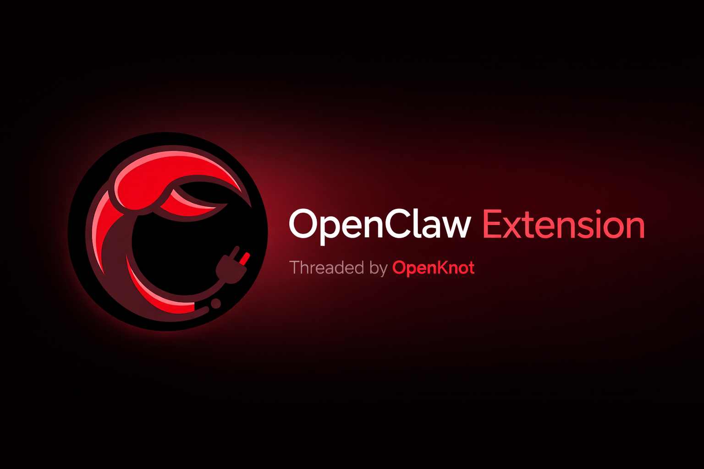
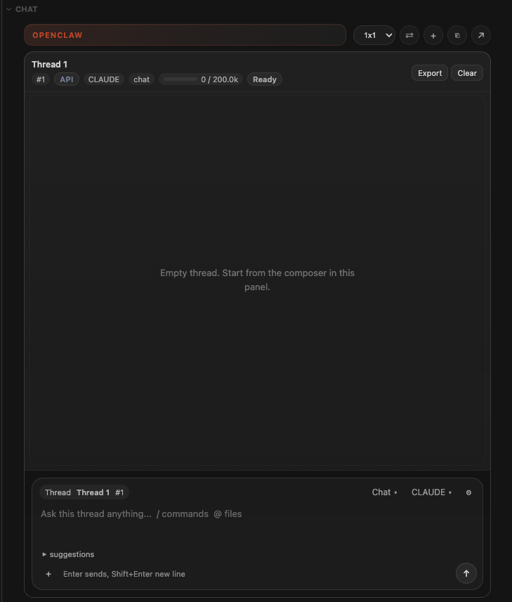
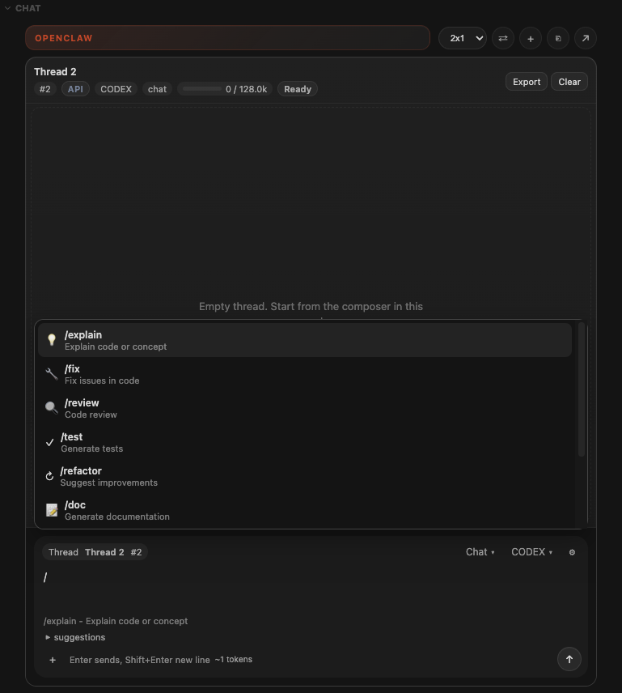
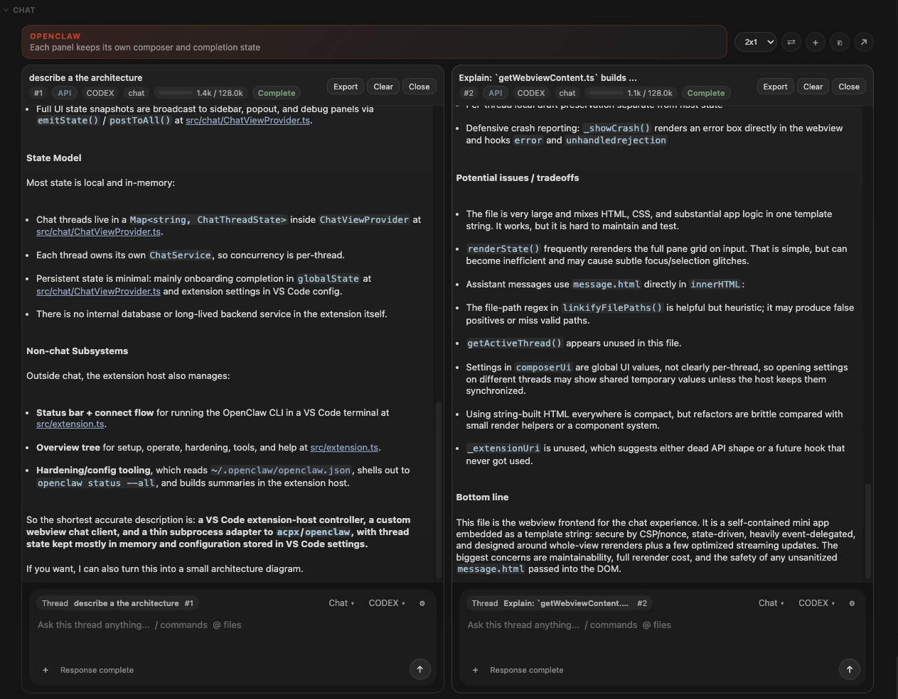

# OpenClaw VS Code Extension

A full-featured VS Code companion for [OpenClaw](https://docs.openclaw.ai) — chat with any codebase, run security hardening, manage tools, and connect to the OpenClaw gateway, all from the sidebar.

> Built by [OpenKnot](https://openknot.ai)

## Screenshots

### Single Chat



The sidebar chat view supports file mentions, attachments, and streamed responses in a focused single-thread layout.

### Slash Commands



Type `/` in the composer to open command shortcuts like `/explain`, `/fix`, `/review`, `/test`, and more.

### Multi-Thread Layout



OpenClaw can split the chat into multiple panes so you can work on separate threads side by side.

## Features

### Chat Panel

An AI chat interface lives in the OpenClaw sidebar. Each message spawns an ephemeral `acpx exec` session scoped to your workspace — no persistent state, no cleanup.

- **Slash commands** — type `/` to open the autocomplete dropdown, then pick a command:

  | Command | What it does | Context injected |
  |---------|-------------|-----------------|
  | `/explain` | Explain code or a concept | Active selection or file |
  | `/fix` | Find and fix issues | Diagnostics + code |
  | `/review` | Code review | Git diff |
  | `/test` | Generate tests | Active selection or file |
  | `/refactor` | Suggest improvements | Active selection or file |
  | `/doc` | Generate documentation | Active selection or file |
  | `/commit` | Draft a commit message | Staged changes |
  | `/harden` | Security analysis | Full file content |
  | `/search` | Search the codebase | None (free-form query) |

- **`@`-mention files** — type `@` in the input to search and attach workspace files as context. Supports keyboard navigation, mouse selection, and shows open tabs when the query is empty.
- **File attachments** — click the `+` button to attach any file via the system file picker. Attached files appear as removable pills below the input.
- **Recommendation chips** — context-aware quick-action suggestions that update as you change editors, selections, and diagnostics. Shown before the first message.
- **Streaming responses** — assistant text streams in incrementally with tool-call badges showing which files the agent reads or modifies.
- **Pop-out** — move the chat into a standalone editor panel with full conversation transfer.
- **Onboarding carousel** — a three-slide walkthrough shown on first use, covering codebase chat, security hardening, and setup tips. Persisted in `globalState` so it only appears once.

### Status Bar

- **Connection indicator** — shows idle, connecting, connected, and error states at a glance.
- **One-click connect** — runs your configured OpenClaw command in a dedicated terminal.
- **Terminal reuse** — keeps a single terminal session for quick reconnects.
- **Auto-connect** — optionally run the command on startup.

### Overview Panel

The OpenClaw activity bar container includes an Overview tree with five sections:

| Section | What's inside |
|---------|--------------|
| **Getting Started** | Connect, Setup, Model Setup Wizard |
| **Operate** | Status check, Doctor, Update, Reconfigure, Dashboard, Config file |
| **Hardening** | Run hardening workflow, Access summary, Security docs |
| **Tools** | List tools from `~/.openclaw/openclaw.json`, enable/disable, uninstall |
| **Help** | Docs link, Refresh view |

### Security Hardening

Run **OpenClaw: Harden** from the Command Palette or the Overview tree to execute `openclaw security audit`, `--fix`, and `--deep` in sequence. The hardening mode is configurable (full, audit only, or audit + fix).

The **Access Summary** generates a plain-English Markdown report of MCP servers, tools, API key sources, network endpoints, and local files detected from your config and CLI output.

### Model Setup Wizard

Run **OpenClaw: Model Setup Wizard** to:

1. Run the onboarding wizard (`openclaw onboard`)
2. Pick a provider (OpenAI, Anthropic, Google Gemini, Ollama, Local Pi RPC, or custom)
3. Open your config and auth profile files
4. Verify health with `openclaw doctor` and `openclaw gateway status`

### Guided Setup

If the CLI is missing, the extension offers install actions automatically. You can also run **OpenClaw: Setup** from the Command Palette to:

- Install via the platform-specific shell script (macOS/Linux) or PowerShell script (Windows)
- Install Node.js (Homebrew, winget, or apt)
- Install via npm
- Open the installation docs

Legacy CLI names (`molt`, `clawdbot`) are detected and the extension prompts to migrate.

## Quick Start

### 1. Install Node.js

Download from [nodejs.org](https://nodejs.org) — Node 24 recommended (Node 22.16+ also supported).

Verify: `node -v` shows `v22.16` or newer.

### 2. Install OpenClaw

```
npm install -g openclaw@latest
```

Verify: `openclaw --help`

### 3. Install acpx (for Chat)

```
npm install -g acpx
```

### 4. Onboard and start the Gateway

```
openclaw onboard --install-daemon
```

Verify the Gateway is running:

```
openclaw gateway status
openclaw dashboard
```

### 5. Log in to a channel (optional)

```
openclaw channels login
```

### 6. Use the extension

- Click the **OpenClaw** status bar item to connect.
- Open the **OpenClaw** sidebar to chat, browse the overview, or run hardening.

## Commands

| Command | Description |
|---------|------------|
| `OpenClaw: Connect` | Run your configured CLI command in a terminal |
| `OpenClaw: Setup` | Guided install for Node.js and OpenClaw |
| `OpenClaw: Model Setup Wizard` | Onboarding + provider selection |
| `OpenClaw: Harden` | Run security hardening workflow |
| `OpenClaw: Hardening Access Summary` | Generate a plain-English access report |
| `OpenClaw: Open Chat` | Focus the Chat view in the sidebar |
| `OpenClaw: Pop Out Chat` | Move chat into a standalone editor panel |
| `OpenClaw: New Chat Session` | Clear conversation and start fresh |

## Configuration

| Setting | Default | Description |
|---------|---------|------------|
| `openclaw.autoConnect` | `false` | Automatically connect on startup |
| `openclaw.command` | `openclaw status` | Command to run when connecting |
| `openclaw.hardening.mode` | `full` | Hardening workflow: `full`, `audit`, or `auditFix` |
| `openclaw.hardening.command` | `openclaw` | Command prefix for hardening |
| `openclaw.chat.agent` | `codex` | Agent for chat sessions (any `acpx` agent: `codex`, `gemini`, `opencode`, etc.) |
| `openclaw.chat.permissions` | `approve-reads` | Permission mode: `approve-reads`, `approve-all`, or `deny-all` |

### Windows + WSL

Set `openclaw.command` to `wsl openclaw status` and `openclaw.hardening.command` to `wsl openclaw`.

## Troubleshooting

### "command not found: openclaw"

- Reinstall: `npm install -g openclaw@latest`
- Restart your terminal or VS Code
- Or run **OpenClaw: Setup** for the guided installer

### Legacy CLI name (molt or clawdbot)

Update to `openclaw`:

- Recommended: `curl -fsSL https://openclaw.ai/install.sh | bash`
- npm: `npm install -g openclaw@latest`
- Then run: `openclaw doctor`

See [update docs](https://docs.openclaw.ai/install/updating) for full guidance.

### "node: command not found" or Node too old

Install from [nodejs.org](https://nodejs.org/) — Node 24 recommended (Node 22.16+ also supported). Verify with `node -v`.

### "acpx not found"

The Chat panel requires `acpx` installed globally:

```
npm install -g acpx
```

### Gateway not running

- Check: `openclaw gateway status`
- Restart: `openclaw gateway restart`
- Dashboard: `openclaw dashboard`

### No status bar item

- Ensure you are in the Extension Development Host when testing
- Check the Output panel for extension logs

## Development

1. Install dependencies: `pnpm install`
2. Compile: `pnpm run compile`
3. Press **F5** to launch the Extension Development Host
4. Publish (prepublish + VSCE + Open VSX): `pnpm run publish:all`

## License

[MIT](./LICENSE)
