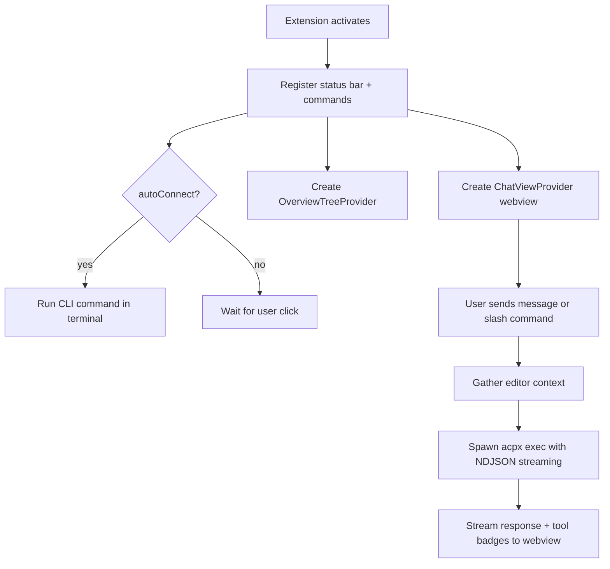

# OpenClaw Extension — Quick Summary

A VS Code sidebar companion for OpenClaw that lets you chat with your codebase, run security hardening, manage tools, and connect to the gateway.

## What It Does

- **Chat** — talk to an AI agent about your code, scoped to your workspace. Each message runs an ephemeral `acpx exec` session.
- **Slash commands** — `/explain`, `/fix`, `/review`, `/test`, `/refactor`, `/doc`, `/commit`, `/harden`, `/search`. Each injects the right editor context automatically.
- **`@`-mention files** — type `@` in the input to search and attach workspace files.
- **Recommendation chips** — context-aware suggestions that appear before the first message, updating as you change editors and selections.
- **Status bar** — shows connection state (idle / connecting / connected / error). Click to run your OpenClaw CLI command.
- **Overview panel** — tree view with Getting Started, Operate, Hardening, Tools, and Help sections.
- **Security hardening** — run `openclaw security audit`, `--fix`, and `--deep` in sequence, plus a plain-English access summary.
- **Tool management** — list, enable/disable, and uninstall tools read from `~/.openclaw/openclaw.json`.
- **Model Setup Wizard** — run onboarding, pick a provider, open config/auth files.
- **Guided install** — detects missing Node.js or OpenClaw CLI and offers install actions.
- **Legacy migration** — prompts to upgrade from `molt` / `clawdbot` to `openclaw`.

## The Simplest Path

1. Install the CLI: `npm install -g openclaw@latest`
2. Install acpx: `npm install -g acpx`
3. Onboard: `openclaw onboard --install-daemon`
4. Open the OpenClaw sidebar and start chatting, or click the status bar item to connect.

## Commands

- **OpenClaw: Connect** — run your CLI command in a terminal
- **OpenClaw: Setup** — guided install for Node.js and OpenClaw
- **OpenClaw: Model Setup Wizard** — onboarding + provider selection
- **OpenClaw: Harden** — security hardening workflow
- **OpenClaw: Open Chat** — focus the sidebar chat
- **OpenClaw: Pop Out Chat** — move chat into an editor panel
- **OpenClaw: New Chat Session** — clear conversation

## Key Settings

| Setting | Default | What it controls |
|---------|---------|-----------------|
| `openclaw.command` | `openclaw status` | CLI command the status bar runs |
| `openclaw.autoConnect` | `false` | Auto-run on startup |
| `openclaw.chat.agent` | `codex` | Agent used for chat (`codex`, `gemini`, `opencode`, etc.) |
| `openclaw.chat.permissions` | `approve-reads` | Permission mode for the chat agent |
| `openclaw.hardening.mode` | `full` | Hardening scope: `full`, `audit`, or `auditFix` |

For WSL: set `openclaw.command` to `wsl openclaw status`.

## Status Bar States

| Icon | Meaning |
|------|---------|
| `$(plug) OpenClaw` | Idle — click to connect |
| `$(sync~spin) OpenClaw` | Connecting |
| `$(check) OpenClaw` | Connected (command sent) |
| `$(alert) OpenClaw` | Error — click to retry |

## Architecture

## Troubleshooting (Short Version)

- **"command not found: openclaw"** — run `OpenClaw: Setup` or `npm install -g openclaw@latest`
- **"acpx not found"** — `npm install -g acpx`
- **"node: command not found"** — install from [nodejs.org](https://nodejs.org/)
- **Gateway not running** — `openclaw gateway restart`
